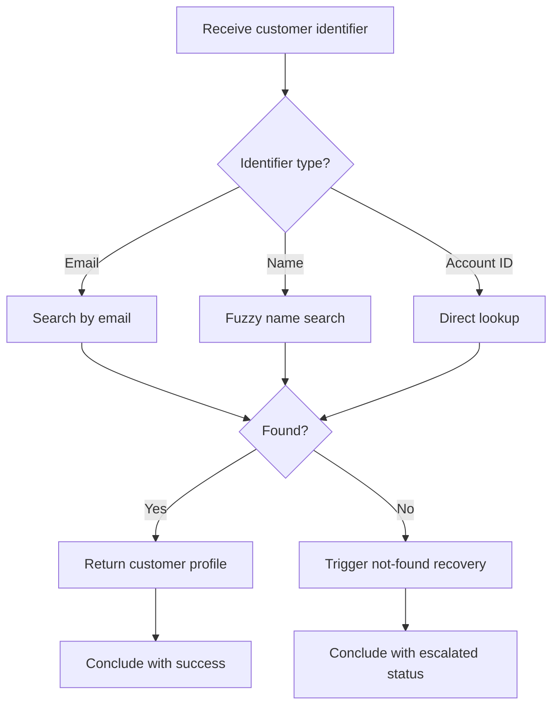

# 👤 Customer Lookup

**Type:** forward
**Status:** active
**Connections:** [sentiment_analysis]
**Compact Identifier:** 👤

Look up a customer by name, email, or account ID and return their profile, order history, and account status.

## Workflow Notes

- Email search is exact match; name search uses fuzzy matching with Levenshtein distance
- Account ID lookup is the fastest path — prefer it when available
- Customer profile includes: name, email, account status, order count, lifetime value, last activity date
