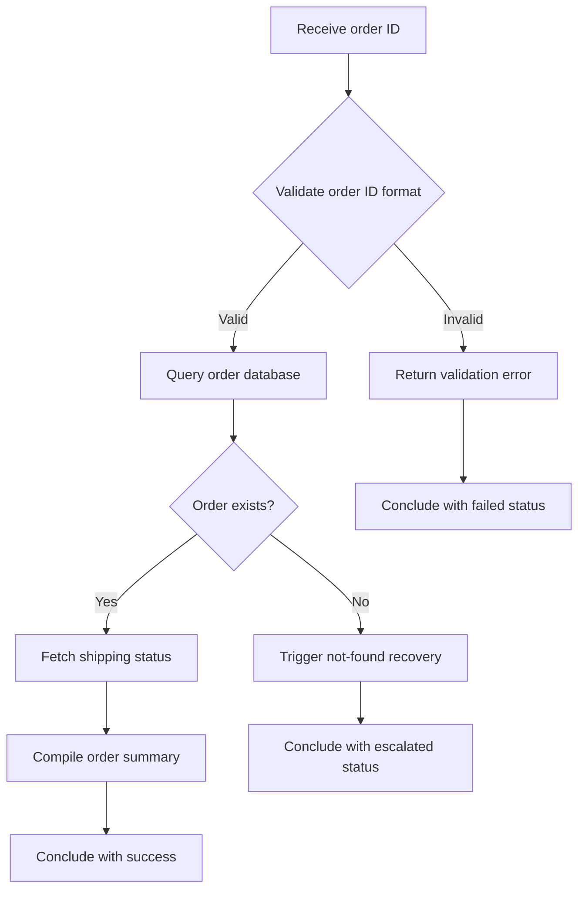

# 📦 Order Status Check

**Type:** forward
**Status:** active
**Connections:** [customer_lookup]
**Compact Identifier:** 📦

Check the current status of an order including shipping, payment, and fulfillment details.

## Workflow Notes

- Order summary includes: items, quantities, payment status, shipping carrier, tracking number, estimated delivery
- Connected to customer_lookup because order queries often need customer context
- If the order ID looks like a tracking number instead, suggest the user meant shipment tracking
