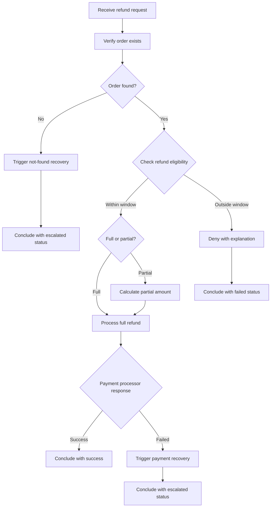

# 💸 Refund Processing

**Type:** forward
**Status:** active
**Connections:** [order_status, payment_failed_recovery]
**Compact Identifier:** 💸

Process a refund for a completed order, validating eligibility and initiating the return flow.

## Workflow Notes

- Refund window is 30 days from delivery date — configurable per merchant
- Partial refunds require an itemized breakdown of what's being returned
- Connected to order_status because refunds require order verification first
- Connected to payment_failed_recovery for handling payment processor failures
