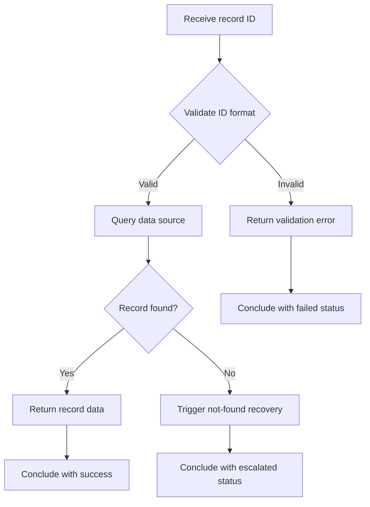

# 🔍 Record Lookup

**Type:** forward
**Status:** active
**Connections:** [sample_not_found]
**Compact Identifier:** 🔍

Look up a record by its unique identifier across available data sources.

## Workflow Notes

- The ID format validation checks for expected patterns (UUID, numeric, etc.)
- The data source query is a tool call — the specific tool depends on the domain
- When no record is found, the `sample_not_found` recovery piece handles the response
