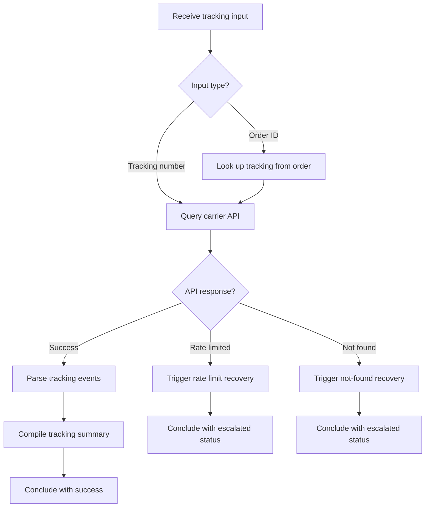

# 🚚 Shipment Tracking

**Type:** forward
**Status:** active
**Connections:** [order_status, rate_limit_recovery]
**Compact Identifier:** 🚚

Track a shipment using a tracking number or order ID, returning real-time location and delivery estimate.

## Workflow Notes

- Supports UPS, FedEx, USPS, DHL carrier APIs
- Connected to order_status because tracking often starts from an order lookup
- Rate limit recovery handles carrier API throttling with exponential backoff
- Tracking summary: current location, status, estimated delivery, event history
