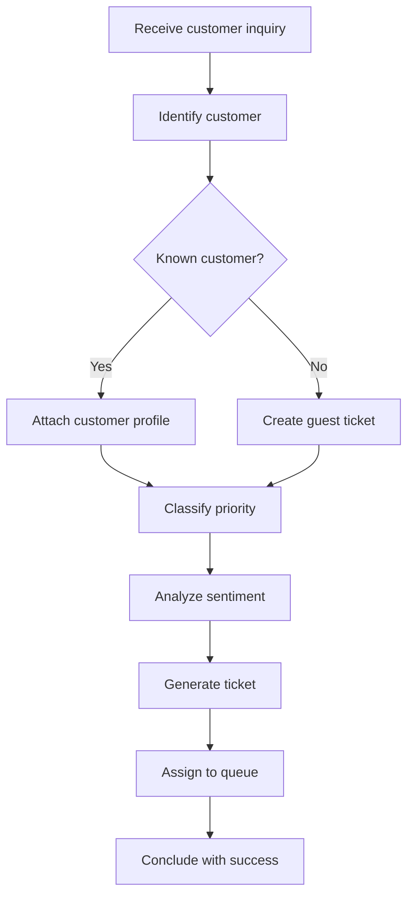

# 🎫 Support Ticket Creation

**Type:** forward
**Status:** active
**Connections:** [customer_lookup, priority_classification, sentiment_analysis]
**Compact Identifier:** 🎫

Create a new support ticket from a customer inquiry, auto-classifying priority and sentiment.

## Workflow Notes

- Priority classification uses the priority_classification skill
- Sentiment analysis informs urgency — angry customers get escalated faster
- Ticket includes: customer info, inquiry text, priority level, sentiment score, suggested category
- Auto-routes to specialized queues: billing, technical, shipping, general
