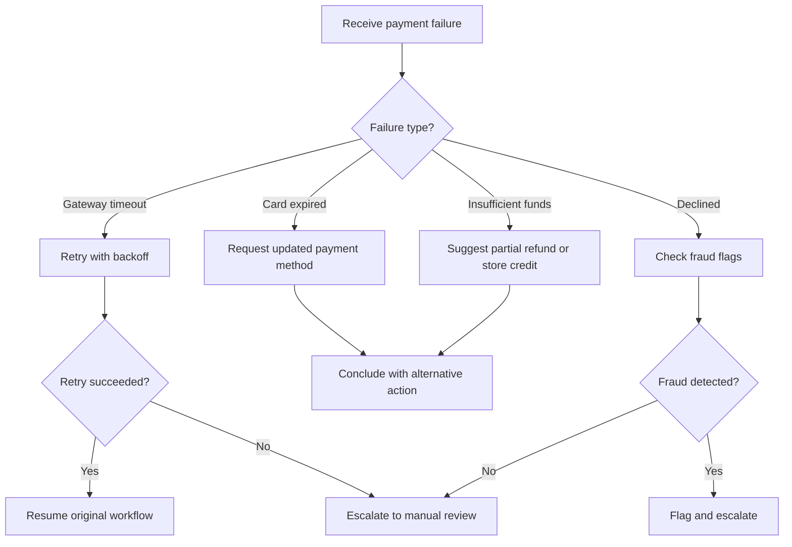

# 💳 Payment Failed Recovery

**Type:** recovery
**Status:** active
**Connections:** [refund_processing]
**Response Shapes Handled:** [payment_declined, gateway_timeout, insufficient_funds, card_expired]
**Compact Identifier:** 💳

Recovery anti-workflow for payment processor failures during refund or charge operations.

## Recovery Notes

- Gateway timeouts get 3 retries with exponential backoff (1s, 3s, 9s)
- Card expired is not retryable — must collect new payment info
- Fraud detection is a heuristic check, not definitive — always escalate for human review
- This piece is connected to refund_processing as its primary caller
