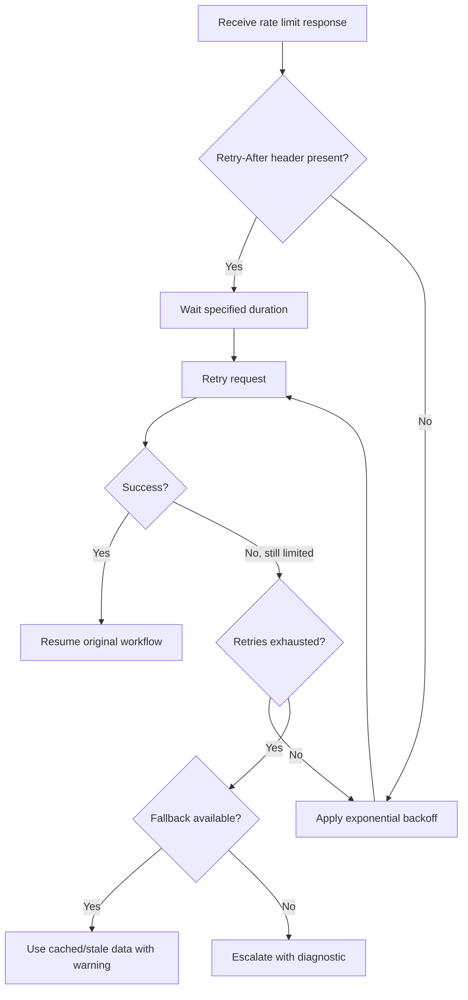

# ⏱️ Rate Limit Recovery

**Type:** recovery
**Status:** active
**Connections:** [shipment_tracking]
**Response Shapes Handled:** [rate_limited, 429, too_many_requests, throttled]
**Compact Identifier:** ⏱️

Recovery anti-workflow for external API rate limiting, with retry strategies and fallback options.

## Recovery Notes

- Respects Retry-After headers when present — never ignore them
- Exponential backoff: 1s, 2s, 4s, 8s (max 3 retries before fallback)
- Cached data fallback includes a staleness warning so the user knows it may be outdated
- Connected to shipment_tracking as primary consumer (carrier APIs rate limit aggressively)
