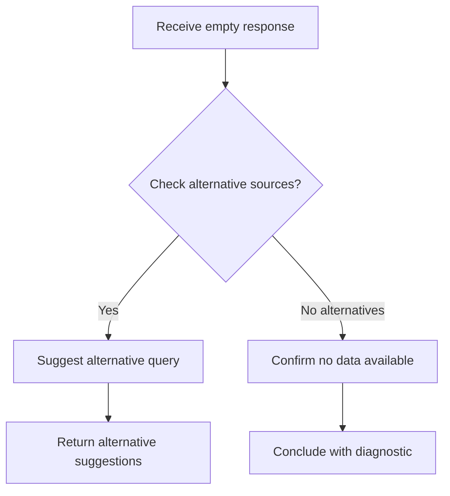

# ❌ Not Found Recovery

**Type:** recovery
**Status:** active
**Connections:** [sample_lookup]
**Response Shapes Handled:** [no_results, empty_response, 404]
**Compact Identifier:** ❌

Recovery anti-workflow for when a lookup returns no results.

## Recovery Notes

- This piece fires when a forward lookup piece encounters an empty or 404 response
- The decision at node B is LLM-bridged — it uses domain context to decide whether alternative sources exist
- If alternatives exist, the recovery suggests reformulated queries rather than executing them (recovery recovers, it does not take over the forward workflow)
